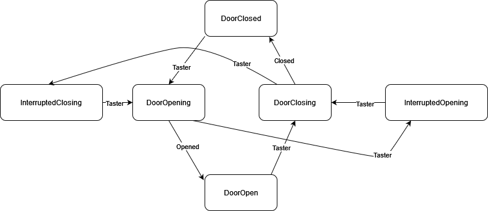

# Design patterns in RUST
This repository is shows hot to implement the mediator and state design pattern in rust. 

## Mediator design pattern
This pattern is implemented on a real life situation, a little simplified. The problem is to schedule airplane landings. The idea based on the mediator pattern is to introduce a mediator, in this example it is an object of type `AirTrafficControl` that implements the trait `Mediator` trait. This object does everything for us.

You can run the program with the next command `cargo run --example mediator`. After running the program you will get an output `Enter command: `. Here you can register a new plane, request landing, report a malfunction and report a landing.

If you want to register a new plane type `register <id> <fuel-left> <distance-from-airport>`.

If you want to request landing type `request <id>`.

If you want to report a malfunction type `malfunction <id>`.

If you want to report a landing type `clear`.

## State design pattern
The state pattern is very useful when we want to define the behaviour of a system. Here we are going to show this on an example of an automated door. The finite state machine that represents the system behaviour is given on the picture below.

